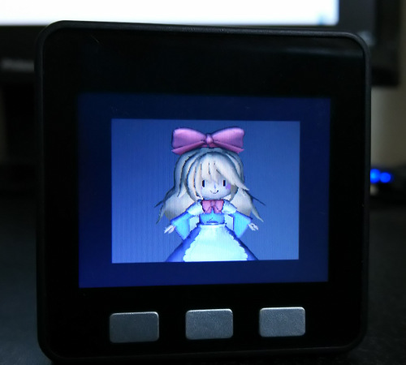
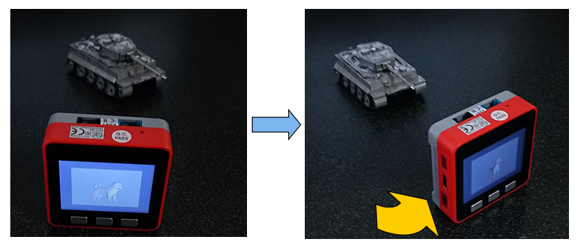
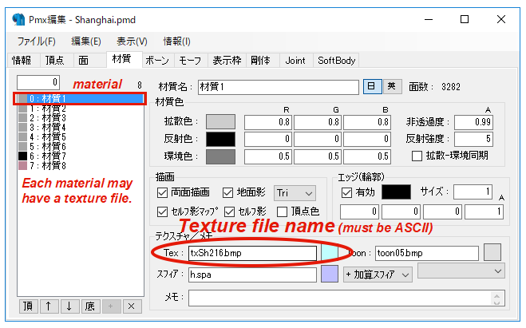

# M5Stack_MMD
3D rendering by M5Stack 
  

## Prepare
- [M5Stack](https://www.switch-science.com/catalog/3647/)  : Switch Science (for M5Stack_MMD)
 or
- [M5Stack FIRE](https://www.switch-science.com/catalog/3953/)  : Switch Science (for M5StackFIRE_MMD)

## Development Environment
- [Arduino IDE](https://www.arduino.cc/en/main/software)
- [arduino-esp32](https://github.com/espressif/arduino-esp32)

## About M5Stack_MMD
- You can move, rotate, or scale the 3D model by rewriting MatrixFactory.h.
- You can save the screen as bitmap file to SD card by enabling bitmap_out in M5Stack_MMD.ino.
- In the current version, the code includes a MMD model data (PMD file) as constant arrays. 
  You can change a MMD model by rewriting  arrays EmbemddedFile.h. 
  The arrays and simply made from PMD file and BITMAP files for texture by Binary To Text Converter. 
  BITMAP file type has to be 16bit ARGB(1-5-5-5) and the sizes of the files must be same. 
  And you should take care ROM size of hardware.

note: This code includes MMD model data (PMD file) as constant arrays. Normal M5Stack can't deal PMD file in SD card at a sufficient speed because of insufficient RAM. It takes <b>3 minites</b> to open this files including the large constant arrays by Arduino IDE. 

## About M5StackFIRE_MMD
M5Stack FIRE has 4M PSRAM. It can realize to draw any 3D models in SD card.
Example models are in /Model directory in this repository. 
Put PMD files and BMP files into root directory in your SD card.
You can specify a PMD file in SD card in M5StackFIRE_MMD.ino as "mesh = new Mesh("/dog.pmd");" 
  
- You can move, rotate, or scale the 3D model by moving M5Stack body like AR. This is realized by 6-axis sensor mounted in M5Stack FIRE.
  
- You can save the screen as bitmap file to SD card by uncomment the last lines in M5StackFIRE_MMD.ino.
- You can use favorite PMD files. You find many PMD files on the Web. You may have to modify the data to satisfy restrictions for M5StackFIRE_MMD as below. 
  Restriction 1 : PMD file name and Texture file name must be ASCII. 
  Restriction 2 : Texture file type must be be 16bit ARGB(1-5-5-5) 128x128 pixel BITMAP. 
  <b>Notice : Follow the TERMS OF USE of each 3D model when you use 3D models.</b>
- Rendering speed : About 27000 polygons per second. 
  
## About MMD
- see [VPVP wiki](https://www6.atwiki.jp/vpvpwiki) to know MMD
- use [Gimp](https://www.gimp.org/) to convert texture file.
- use [Pmxeditor](http://kkhk22.seesaa.net/category/14045227-1.html) to rename texture file (Japanse -> ASCII). 
 

## Theory
see [【ゆっくり解説】 PICマイコンでMMD 【電子工作】](https://www.nicovideo.jp/watch/sm21224686) to learn 3D rendering by microcontroller. (In Japanse)
